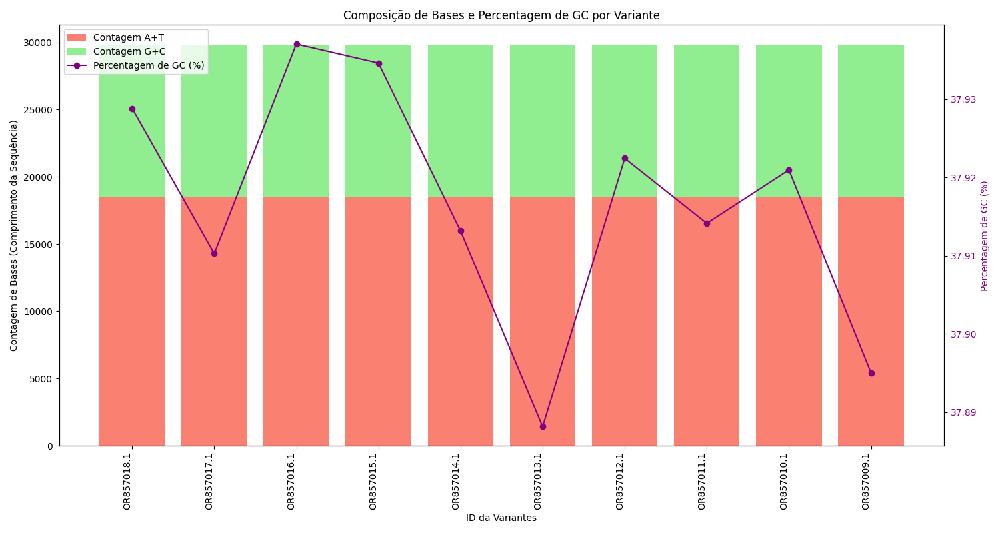

# Análise de Sequências de SARS-CoV-2: Frequência de Pares de Bases e Porcentagem de GC

Este projeto consiste em um script Python que analisa sequências genômicas do SARS-CoV-2 presentes em um arquivo no formato FASTA. O objetivo principal é calcular a frequência dos pares de bases Adenina (A), Timina (T), Guanina (G) e Citosina (C), bem como determinar a porcentagem de Guanina e Citosina (GC) em cada sequência. Além disso, o script gera uma visualização gráfica combinando a composição das bases e a porcentagem de GC para cada variante analisada.

## Funcionalidades

O script realiza as seguintes etapas:

1.  **Importação de Dados:** Lê sequências genômicas de um arquivo FASTA.
2.  **Análise de Sequências:** Para cada sequência, identifica o ID e calcula o comprimento.
3.  **Contagem de Bases:** Determina a frequência dos pares de bases A-T e G-C.
4.  **Cálculo da Porcentagem de GC:** Calcula a proporção de bases G e C no total da sequência.
5.  **Visualização:** Gera um gráfico que exibe a composição das bases (A+T e G+C como barras empilhadas) e a porcentagem de GC (como uma linha sobreposta) para cada sequência identificada.

## Exemplo do Gráfico

## Composição de Bases e Percentagem de GC por Variante

- Tipo de Gráfico: Combinação de gráfico de barras empilhadas e gráfico de linha com dois eixos y.

Eixo x: "ID da Variantes". Este eixo horizontal lista os identificadores de diferentes variantes do SARS-CoV-2. Os IDs parecem ser strings alfanuméricas (ex: OR857018.1, OR857017.1, etc.).

Eixo y esquerdo: "Contagem de Bases (Comprimento da Sequência)". Este eixo vertical à esquerda representa a contagem de nucleotídeos (Adenina, Timina, Guanina, Citosina) e, portanto, o comprimento total de cada sequência variante. As unidades estão em número de bases.

- Barras Empilhadas: Para cada variante no eixo x, há uma barra dividida em duas cores:
  Vermelho Claro (Salmão): Representa a "Contagem A+T" (Adenina + Timina). Esta é a porção inferior da barra.
  Verde Claro (Lima): Representa a "Contagem G+C" (Guanina + Citosina). Esta seção é empilhada sobre a contagem de A+T.
  A altura total de cada barra representa o comprimento total da sequência para aquela variante (Contagem A+T + Contagem G+C).
  Eixo y direito: "Percentagem de GC (%)". Este eixo vertical à direita representa a porcentagem de Guanina (G) e Citosina (C) no total da sequência para cada variante. As unidades estão em porcentagem.

- Linha com Marcadores: Uma linha contínua na cor roxa com marcadores circulares conecta pontos que representam a porcentagem de GC para cada variante correspondente no eixo x. Os valores da porcentagem de GC são lidos neste eixo y direito.

## Legenda:

Vermelho Claro: Contagem A+T
Verde Claro: Contagem G+C
Roxo com Marcadores: Percentagem de GC (%)
Interpretação Geral:

- O gráfico visa comparar a composição das bases (a quantidade de A e T versus a quantidade de G e C) e a porcentagem de GC entre diferentes variantes do SARS-CoV-2. Ao observar a altura das barras empilhadas, podemos comparar os comprimentos das sequências. Ao analisar a proporção das seções vermelha e verde nas barras, podemos ver a contribuição de cada tipo de par de bases para o comprimento total. A linha roxa sobreposta fornece uma visão direta da porcentagem de GC para cada variante, permitindo identificar padrões ou variações nessa métrica entre as diferentes sequências.

Por exemplo, podemos observar que algumas variantes têm comprimentos de sequência semelhantes (altura das barras), mas podem apresentar diferentes proporções de A+T e G+C, resultando em diferentes porcentagens de GC (posição da linha roxa em relação ao eixo y direito).

## Próximos Passos e Melhorias Potenciais:

- Análise Estatística: Adicionar cálculos estatísticos como média, mediana, desvio padrão da porcentagem de GC entre as variantes.

- Comparação de Variantes: Implementar funcionalidades para comparar a composição de bases e a porcentagem de GC entre diferentes grupos de variantes.

- Salvar Resultados: Permitir que os resultados da análise (tabelas de dados, gráfico) sejam salvos em arquivos (por exemplo, CSV, PNG).

- Tratamento de Erros: Adicionar um tratamento de erros mais robusto para lidar com arquivos FASTA mal formatados ou sequências inválidas.

- Argumentos de Linha de Comando: Permitir que o caminho do arquivo FASTA seja fornecido como um argumento de linha de comando para maior flexibilidade.

Autor
LUCAS GREZZI (@lucasgrezzi)
